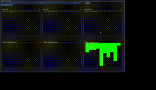

# SortVis

## About
Provides a visualization of common sorting algorithms. 

#### Sorting Algorithms Include:
- Selection sort
- Insertion sort
- Bubble sort 
- Merge sort (iterative and recursive)
- Quick sort (iterative and recursive)
- Heap sort

Can choose which sorting algorithms to see working side by side and compare speeds as well as set the amount of elements to sort. Changing the duration of the thread's sleep in the waitTime() function in sorting_algos.h will slow down or speed up sorting time, allowing for better visualization.

This project was created as a learning exercise in c++ gui design with ImGui and is my first time working with gui's and threading in c++.

## Dependencies

- Vanilla ImGui 1.72+
- OpenGL
- SDL2
- C++17
- CMake

## Building/Installation
Clone repository in command line with:
```
git clone https://github.com/JoWatersASC/SortVis.git
```
Once cloned, navigate to build folder, run cmake, and build with make
```
cd SortVis/build/
cmake -S .. -B .
make
```

All files needed should be included in the include folder, but if you need to download SDL2 run
```
sudo apt install libsdl2-dev
```
on Linux. For Windows, go to the [SDL2 GitHub](https://github.com/libsdl-org/SDL/releases/tag/release-2.30.5)
and download the zip file and extract. 


If running on Windows, a Visual Studio solution will be created, simply open and run. If on Linux, an executable will be created and can be ran automatically.
